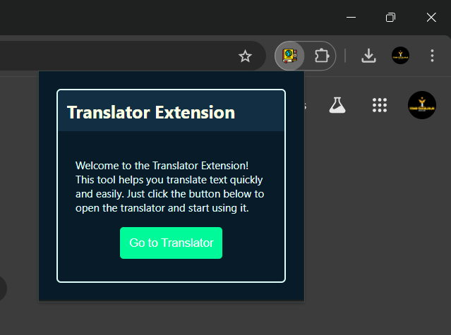
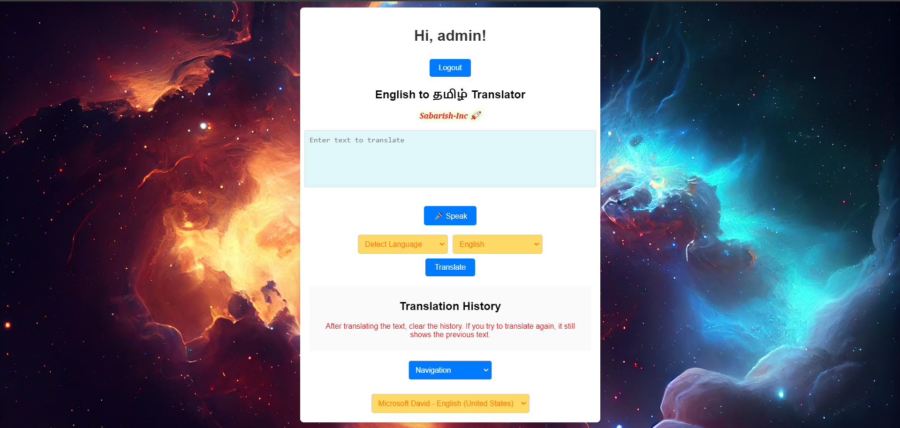

# Multilingual Translation and Speech Synthesis Application

## Overview

This web application provides a comprehensive translation service that supports translating text between multiple languages using the Google Translate API. It includes features like speech-to-text, voice selection for text-to-speech, translation history, favorites management, and a leaderboard. The application is designed to facilitate easy interaction through its intuitive interface.

## Hosting

The application is hosted at [https://tamiltranslator.pythonanywhere.com/](https://tamiltranslator.pythonanywhere.com/).

## Features

- **Text Translation**: Translate text between various languages.
- **Speech-to-Text**: Convert spoken words into text using the browser's speech recognition capabilities.
- **Voice Selection**: Choose different voices for text-to-speech synthesis.
- **Translation History**: View and download the history of translations.
- **Favorites**: Save and manage favorite translations for quick access.
- **Leaderboard**: View a leaderboard of users with dummy data in this version.

## Setup and Installation

1. **Clone the Repository**

   ```bash
   git clone https://github.com/SabarishCodeWizard/-Multilingual-Translation-and-Speech-Synthesis-Application-.git
   cd Breadcrumbs-Multilingual-Translation-and-Speech-Synthesis-Application-
   ```

2. **Install Dependencies**

   Ensure Python is installed. Create a virtual environment and install the required packages:

   ```bash
   python -m venv venv
   source venv/bin/activate  # On Windows use `venv\Scripts\activate`
   pip install -r requirements.txt
   ```

3. **Run the Application**

   Start the Flask application:

   ```bash
   flask run
   ```

   The application will be available at `http://127.0.0.1:5000/` by default.







## API Endpoints

### 1. **Home Page**

   - **URL**: `/`
   - **Methods**: `GET`, `POST`
   - **Description**: Main interface for text translation. Users can input text to be translated, select source and destination languages, and view translation results.
   - **Request Parameters**:
     - `text`: The text to be translated.
     - `src_lang`: The source language code.
     - `dest_lang`: The destination language code.
   - **Response**: Renders `index.html` with translation results, detected language, and suggestions.

### 2. **History**

   - **URL**: `/history`
   - **Methods**: `GET`
   - **Description**: Displays the history of all translations performed.
   - **Response**: Renders `history.html` with a list of translation history.

### 3. **Favorites**

   - **URL**: `/favorites`
   - **Methods**: `GET`
   - **Description**: Displays the list of favorite translations.
   - **Response**: Renders `favorites.html` with a list of favorite translations.

### 4. **Leaderboard**

   - **URL**: `/leaderboard`
   - **Methods**: `GET`
   - **Description**: Displays a leaderboard of users (dummy data).
   - **Response**: Renders `leaderboard.html` with a list of users and their points.

### 5. **Download History**

   - **URL**: `/download_history`
   - **Methods**: `GET`
   - **Description**: Allows users to download their translation history as a CSV file.
   - **Response**: Returns a CSV file of the translation history.

### 6. **Clear History**

   - **URL**: `/clear_history`
   - **Methods**: `GET`
   - **Description**: Clears the translation history.
   - **Response**: Redirects to the history page with an empty history.

### 7. **Add Favorite**

   - **URL**: `/add_favorite`
   - **Methods**: `POST`
   - **Description**: Adds a translation to the favorites list.
   - **Request Parameters**:
     - `text`: The text to be added to favorites.
     - `translation`: The translated text.
     - `src`: Source language code.
     - `dest`: Destination language code.
   - **Response**: Redirects to the index page.

### 8. **Clear Favorites**

   - **URL**: `/clear_favorites`
   - **Methods**: `GET`
   - **Description**: Clears all favorite translations.
   - **Response**: Redirects to the favorites page with an empty favorites list.

### 9. **Login**

   - **URL**: `/login`
   - **Methods**: `GET`, `POST`
   - **Description**: Allows users to log in.
   - **Request Parameters**:
     - `username`: The username for login.
   - **Response**: Redirects to the index page upon successful login. Renders `login.html` for the login form.

### 10. **Logout**

   - **URL**: `/logout`
   - **Methods**: `GET`
   - **Description**: Logs out the user and redirects to the login page.
   - **Response**: Redirects to the login page.

## JavaScript Functions

### `startDictation()`

- **Description**: Initiates speech recognition to convert spoken text into text input.
- **Dependencies**: `webkitSpeechRecognition`

### `populateVoiceList()`

- **Description**: Populates the voice selection dropdown with available voices for speech synthesis.

### `speak(text)`

- **Description**: Converts the given text to speech using the selected voice from the dropdown.

### `copyText()`

- **Description**: Copies the translated text to the clipboard.

## Language Selection

### Source Language Options

- **Detect Language**: `auto`
- **Languages**:
  - English (`en`)
  - Tamil (`ta`)
  - Spanish (`es`)
  - French (`fr`)
  - German (`de`)
  - Chinese (Simplified) (`zh-cn`)
  - Hindi (`hi`)
  - Japanese (`ja`)
  - Russian (`ru`)
  - Korean (`ko`)
  - Arabic (`ar`)
  - Italian (`it`)
  - Portuguese (`pt`)
  - Bengali (`bn`)

### Destination Language Options

- **Languages**:
  - English (`en`)
  - Tamil (`ta`)
  - Spanish (`es`)
  - French (`fr`)
  - German (`de`)
  - Chinese (Simplified) (`zh-cn`)
  - Hindi (`hi`)
  - Japanese (`ja`)
  - Russian (`ru`)
  - Korean (`ko`)
  - Arabic (`ar`)
  - Italian (`it`)
  - Portuguese (`pt`)
  - Bengali (`bn`)

## Troubleshooting

- **Voice Selection Issues**: Ensure that the `voiceSelect` element is present in the HTML and correctly populated.
- **JavaScript Errors**: Check the console for specific syntax errors and ensure proper script placement.
- **API Errors**: If encountering issues with translation or speech synthesis, verify network connectivity and API limits.


# Tamil Translator Playwright Test

This repository contains Playwright test cases to verify the functionality of a translation web application hosted at `https://tamiltranslator.pythonanywhere.com/`. The tests cover basic login functionality and translation verification.

## Prerequisites

Before you run the tests, ensure you have the following installed on your system:

- Node.js (>= 14.x.x)
- Playwright (`@playwright/test`)

You can install Node.js from the official [Node.js website](https://nodejs.org/).

## Installation

1. Clone the repository:


2. Navigate into the project directory:


3. Install the required dependencies:

```bash
npm install
```

This will install Playwright and other dependencies needed to run the tests.

## Running the Tests

To run the tests, use the following command:

```bash
npx playwright test
```

This will execute the Playwright tests for the Tamil translator web application.

### Test Cases

1. **Successful Login Test**
   - The test navigates to the login page, inputs the username, and logs in.
   - It checks whether the URL changes to the home page after login.

2. **Translation Test**
   - After a successful login, the test fills in a sample text, selects source and destination languages, and clicks the translate button.
   - The test verifies that the correct translation is displayed for the input text.

### Sample Test File

The sample Playwright test file (`example.spec.ts`) includes both the login and translation tests:

```typescript
import { test, expect } from '@playwright/test';

test('successful login', async ({ page }) => {
  await page.goto('https://tamiltranslator.pythonanywhere.com/login');
  await page.fill('input[name="username"]', 'test55');
  await page.click('button[type="submit"]');
  await expect(page).toHaveURL('https://tamiltranslator.pythonanywhere.com/');
  console.log('Login test passed!');
});

test('translation test', async ({ page }) => {
  await page.fill('textarea[name="text"]', 'After translating the text, clear the history...');
  await page.selectOption('select[name="src_lang"]', 'en');
  await page.selectOption('select[name="dest_lang"]', 'ta');
  await page.click('button[type="submit"]');
  
  const translation = page.locator('#translatedText');
  await expect(translation).toHaveText('உரையை மொழிபெயர்த்த பிறகு...');
  console.log('Translation test passed!');
});
```

## Running in Debug Mode

To run the tests in debug mode, use:

```bash
npx playwright test --debug
```

This opens up a browser and shows the test steps being executed, which is useful for troubleshooting.

## Playwright Documentation

For more details on Playwright, refer to the [official Playwright documentation](https://playwright.dev/).

